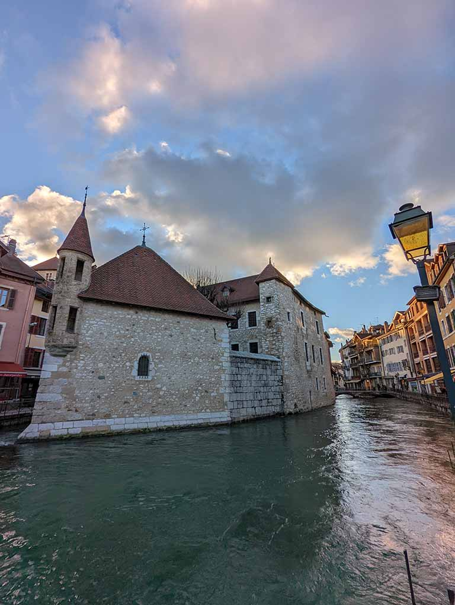
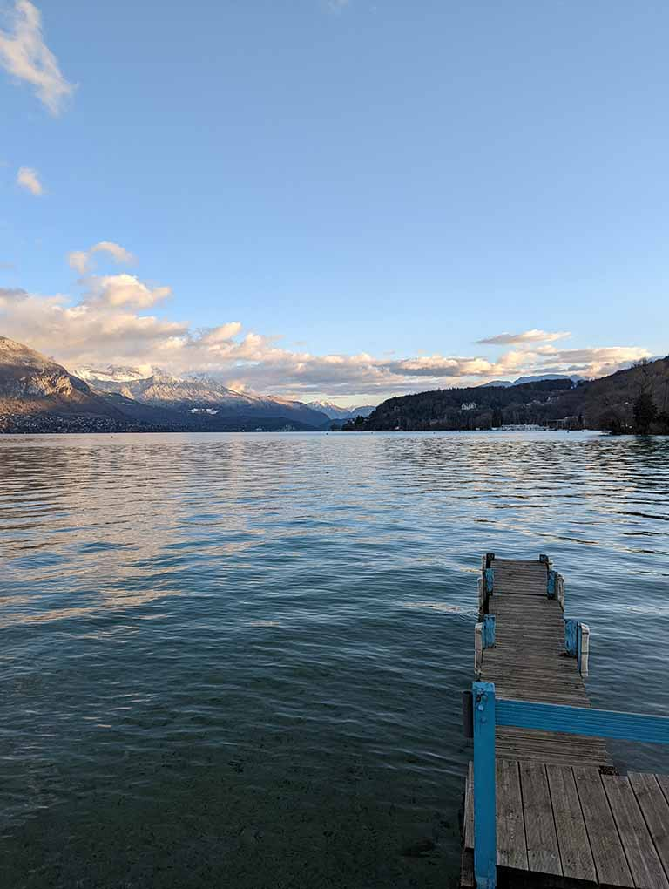
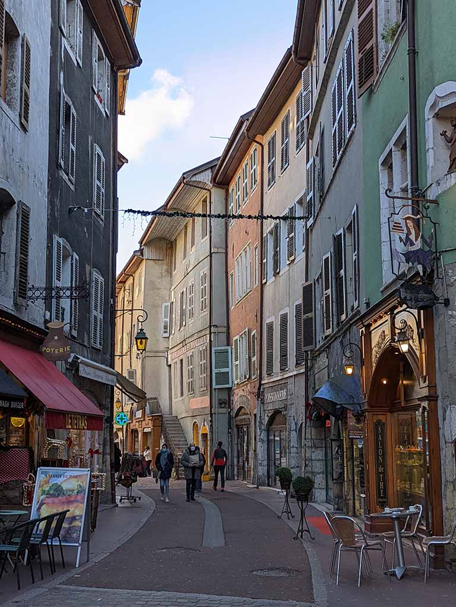

#### Contents

```toc
exclude: Contents
from-heading: 2
to-heading: 6
tight: true
```


Annecy is located at the foot of the French Alps and two hours east of Lyon by train. It's a great day trip location to visit and is definitely worth the visit. From Lyon, there are frequent trains leaving for Annecy, with many return trains available at night.

#### What is Annecy known for?


Known as Venice of France, Annecy has kept its medieval looks around. When you walk out of the main station you will notice the modern buildings however towards Lake Annecy, you will come across canals cutting through the town. The old town of Annecy thrives amongst the canals, where you will find plenty of restaurants hidden away and domed alleys that take cut you through a building to adjacent streets. Lake Annecy and the canals are prominent attractions.

#### Lake Annecy


Lake Annecy does have some activities depending on the time of the year. The walk from the old town to across the Annecy harbor is quite the view as the lake unfolds into the snow-capped mountains. The lake was crystal clear when we visited and we could see the reflection of the mountains in the lake.

#### Château de Menthon-Saint-Bernard

Château de Menthon-Saint-Bernard is located east of the lake and takes 25 minutes of driving to reach. The castle that inspired Walt Disney’s Sleeping Beauty is one of the remaining castles to below to the same family for 20+ generations. The castle has a prime view of the lake and surrounding village. They have guided 45 minutes tours in French which will show the preserved view from its walls, the exceptional furniture, and rooms, including the chapel and inner courtyard and library consisting of 12000 pre-French Revolutionary works.

#### Where to stay in Annecy?


We decided to take a short trip to Annecy on the way to Nice. We found the Best Western Plus Hôtel Carlton, a 3 min walk from the station. The location was convenient considering the amount of luggage we had. The hotel room was quaint and clean. Not too far from the old town and Lake Annecy, great location to catch an early morning train.
