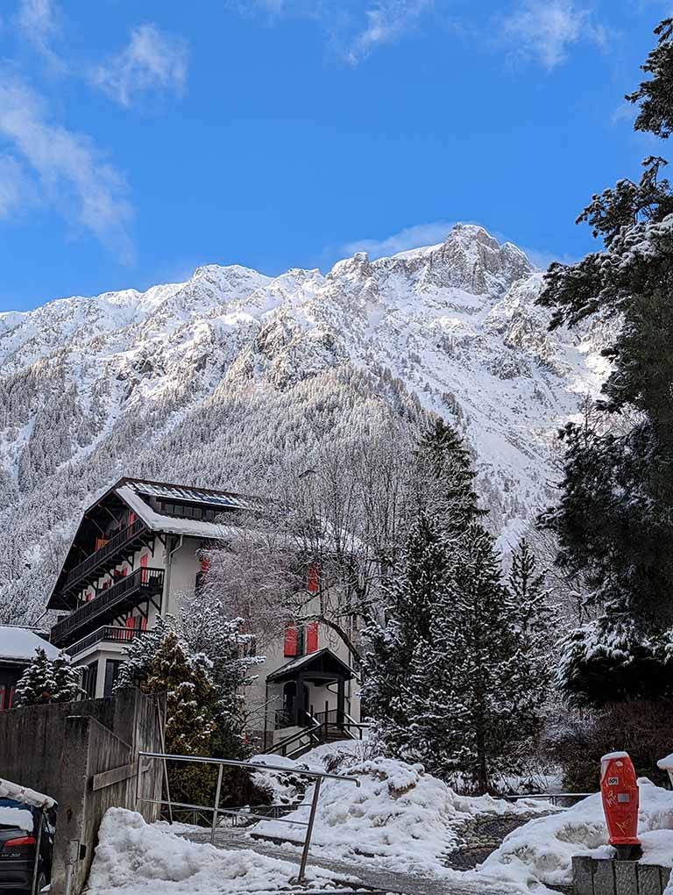
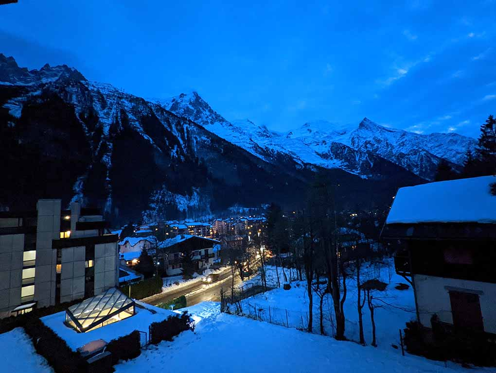
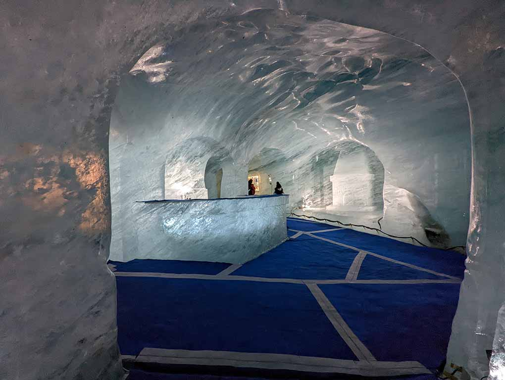
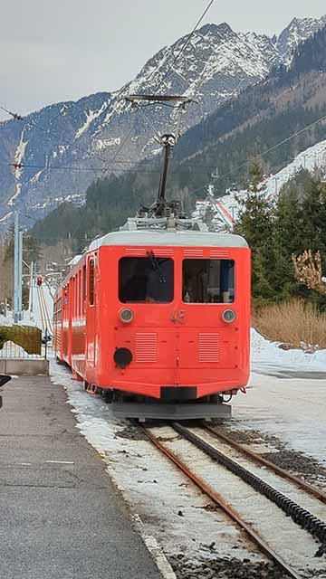

#### Contents

```toc
exclude: Contents
from-heading: 2
to-heading: 6
tight: true
```



#### How to get to Chamonix

Chamonix is a small ski town, in the middle of the French Alps, a town that is postcard personified. Every corner and street is a postcard-perfect. We traveled to Chamonix-Mont-Blanc from Paris. We had made prior reservations on TGV. The reservations were from Paris to Chamonix, with a train change in Saint-Gervais-Les-Bains. From Saint-Gervais, there is a Chamonix-Mont-Blanc regional train that climbs through the valley, traveling to the border of the France-Swiss border, Vallorcine. During our visit, we noticed a train leaving for Vallorcine every 20 minutes. The entire trip can be reserved on the OUI SNCF website. Chamonix town has several stops and the regional train (TER) makes a lengthy stop at Gare de Chamonix-Mont-Blanc. We disembarked at Chamonix Aiguille du Midi station; our hotel was minutes from the station

#### Where to stay in Chamonix-Mont-Blanc



We chose to disembark at Aiguille du Midi station because it was within walking distance of our hotel, Chalet Hotel Le Prieuré. The five minutes walk made it easy to roll our luggage to the hotel. The hotel itself is ideally located, adjacent to the bulk of the major restaurants, pastry shops, and stores. Le Prieure is very well decorated from inside, with two lifts available and beautiful rooms. We chose the mountain view however any of the views from this hotel is breathtaking. The hotel has great service, with a morning buffet available early hours and a restaurant during dinner time. The buffet does have an extensive spread, from fresh croissants to baguettes loaves. And a huge fireplace to wind down the night from a fresh cocktail or a Bordeaux wine. The hotel also had astonishingly high-speed internet, upwards of 50 Mbps, perfect backing up photos and video calls to show off the scenery. With so many restaurants nearby, we kept hopping in and out for food and drinks. The road adjacent to the hotel, heading uphill, leads to **Brévent.** The hotel’s location, dining options, and amazing room make it an ideal place to stay when visiting Chamonix.

#### Weather

The weather does affect the available activities. We initially planned on visiting Aiguille du Midi and Brevente peaks. However, the weather was quite cloudy and the peaks can be quite windy, and on a snowy day, the visibility is reduced. Depending on the weather and the amount of snow, the activities can be limited.

#### Where to ski and snowboard

We noticed skiing was a bit more common than snowboarding. We saw folks carrying their skis to hit up the slopes throughout the town. There are a lot of rental places, and all of them have skis and snowboards available for rent. There are multiple ski lifts available, some ski lifts are grouped while some are individual. We found [Planards](https://www.planards.fr/en) while returning from [Mers De Glace](https://www.chamonix.net/english/leisure/sightseeing/mer-de-glace). Planards has many bunny slopes and is quite beginner-friendly. We saw many instructors on slopes, helping kids out and providing lessons. [Brevente](https://www.montblancnaturalresort.com/en/domaine-skiable-brevent) is located uphill from Hotel Le Prieure. It also has bunny slopes and many small hills where kids can ride sleds down. Brevente also has bigger lifts that climb the mountain for intermediate and expert skiers. I recommend Planards and Brevente for people trying out skiing for the first time.

#### Where to rent skis

Renting ski and snowboarding equipment is quite easy throughout Chamonix. We saw various rental places throughout the town and some hotels also have their little rental shops. Depending on the length of rent, you can pick any shop, and prices are mostly similar. We ended up renting from the nearest rental shop next to Planards; carrying rental equipment can be cumbersome

#### Where to buy ski lift tickets?

Ski lift tickets are readily available, generally at the foot of lifts. There are big ticketing kiosks and usually have a ticket attendant. The pricing of the tickets depends on how many days you wish to ski, and what time of the day you want to ski. Weather can affect ski lifts, so it's best advised to buy tickets when you reach your destination.

Slopes are readily available all over Chamonix and in adjacent towns. If you are looking for more slopes then I recommend checking out [Mont Blanc Natural Resort](<[https://www.montblancnaturalresort.com/en/](https://www.montblancnaturalresort.com/en/)>)

#### What are the attractions in Chamonix?

##### Mers De Glace



Mers De Glace is a massive glacier, located several miles southeast of Chamonix. There is a cogwheel train that takes you up the 22% gradient tracks and the sites that you see along the way are breathtaking. Going up I am glad I sat on the left side of the train. The train takes about 30 minutes to reach the top and there are restaurants, cafes, and several souvenir shops. To reach the glacier, you will have to take a cable car down to the stairs, and then another 30 minutes of climbing down the stairs. As you climb down the stairs, you will see the valley open up to you, the glacier below, and lastly, you will see people entering the glacier. Inside the glacier, you will find an ice cave.



##### Aguille Di Midi

Aguille Di Midi is one of the mountains in the Mont Blanc range, where you can take a cable car to the summit. The peak has a panoramic viewing platform, cafes, and a gift shop. There is also a glacier and a glass skywalk, Step Into the Void, and Le Tube. These attractions are all weather-dependent. The weather is below freezing even during the summer. Lastly, during the summer, the Vallée Blanche Cable Car is open, which lets you cross over Mont Blanc massif itself, connecting Aiguille Di Midi to Pointe Helbronner
