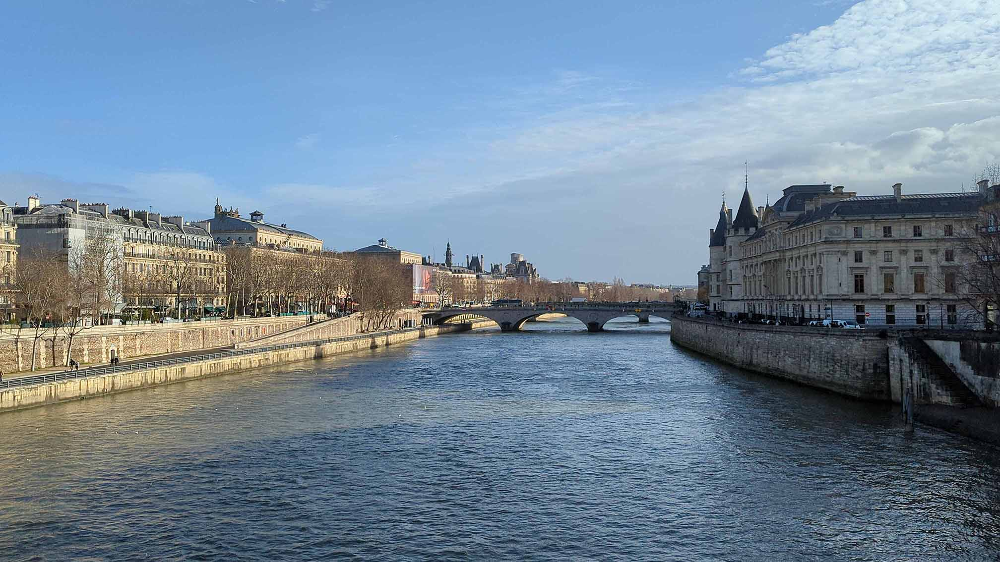
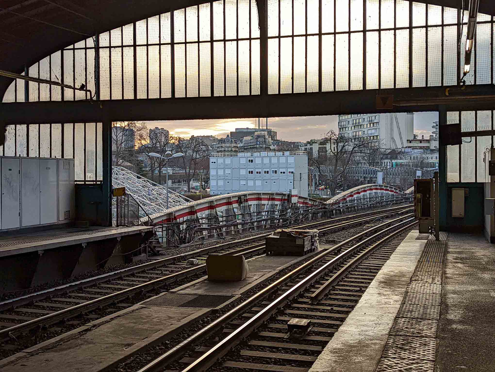

#### Contents

```toc
exclude: Contents
from-heading: 2
to-heading: 6
tight: true
```


Visiting anywhere seems like a task nowadays, especially when testing and regulations due to the pandemic keep changing. I visited France at the end of 2021 and traveled throughout the country.

I live in Texas, USA and we are used to driving everywhere. And to take a break from the driving, we wanted to have a vacation where we could dine and wine, without the worries of driving. We planned our trip to start in Paris, head to Chamonix, and then spend some time in the French Riviera, Nice, Antibes, Monaco.

#### Landing

Landing in CDG was seamless as it could be, with our negative covid test results and sworn statements ready, we cleared the customs without any issues. We received our luggage promptly thanks to priority luggage (Oneworld Ruby) and we were in a taxi within 30 minutes.

#### Getting to our Hotel in Bastille

Our friends visited France several weeks before we did and they recommended the FREE NOW and BOLT rideshare services. We had downloaded the app beforehand and set up our profiles. And we had also downloaded the Paris city map within Google Maps. Look for discount codes on Google Maps, sometimes Google maps have discount codes when you select ride share through the app

#### Moxy Paris Bastille

We arrived quite early at our hotel, Moxy Bastille. Our flight had landed in the late morning, however, Moxy let us check-in early. Hotels in Paris can be quite small. They provide all amenities however luggage space can be quite tight. The beds are framed with cubby holes to slide in the items of luggage. It's a clever use of space, which would be wasted. The bathroom did seem compact at first however after some time we adjusted quickly. The only thing that bothered us was the lack of towel hooks or racks. They had a drying rack outside the bathroom that folded out. The room worked out really well for us. The price was decent, and within the vicinity of the pharmacy, laundromat and supermarket and plenty of restaurants made this hotel a great choice.

#### How to get the Pass Sanitaire/ AntiCovid QR

Pass Sanitaire or Health Pass is a must. From restaurants to TGVs to Eiffel Tower, the pass Sanitaire or AntiCovid app is required. We would be asked to show the QR code at all locations and venues. Intercity trains like TGV require tickets to be linked up to the pass. If you have purchased your TGV ticker prior, you can expect an email to add your Pass Sanitaire to your tickets.

Using the Health Pass website, I found a pharmacy nearby to the Moxy. After checking in, we took our vaccination cards along with our passports and paid 30 Euros a person to register the vaccination. The pharmacist provided us with a printout of a QR code. And we scanned the code onto our AntiCovid app (Android/Apple). And we used to use the app to show the QR code everywhere.

#### Tickets for Eiffel Tower, Palace of Versailles, and Louvre

Paris has various attractions and historical monuments, some are free and open to the public, while most require prior reservation. We initially purchased our Eiffel Tower Summit tickets and assumed we would be able to purchase the rest when we arrived. However, most attractions such as the Louvre and the Palace of Versailles tour were all reserved and sold out. We ended up walking around the Louvre and touring the Jardins du Château de Versailles, the garden behind the palace.

#### Getting Around


While Google Maps did provide directions for busses and the metro, we found the directions were out of date. Several of the bus stops were not in use and many of the timetables for the metro were out of sync. We ended up using the [Ile De France](https://www.iledefrance-mobilites.fr/) link and downloaded the IDF Mobilities app, and used that to navigate around.

#### How to navigate the Paris metro zones

Paris is divided into zones. These zones encircle each other, each zone has its ticket fees. So if you want to go from zone 1 to zone 3, the price is different from traveling within zone 1. Use the [Ile De France](https://www.iledefrance-mobilites.fr/) app to get your directions and ticket information. From Moxy to Versailles is zone 1 to zone 4, and I forgot to buy the zone 4 tickets and I had to pay a hefty fine of 35 Euros per person. The transit authority is before you exit the station, and they are no exceptions. Always check the app purchase accordingly. You can also buy the Paris Visite Ticket, [Paris Visite Ticket](https://www.iledefrance-mobilites.fr/en/tickets-fares/detail/paris-visite-ticket), and depending on the length of your stay and the zones you are visiting, you can buy the weekly or daily pass.

#### How to pay in France

Having a credit card that can tap and pay is essential. From restaurants to ticket kiosks to bike rentals, support tap, and pay. Cards that support tap and pay will have the symbol for tap and pay. Otherwise, cash is a great alternative and will still work at the majority of locations.

#### How to laundry in Paris

Lengthy trips can require a visit to the laundromat. It's common to see laundromats across neighborhoods and we saw locals washing their clothes at the local laundromat. Most laundromats have both a washer and a dryer. Laundromats accept cash and card, tap and pay cards. And the cost of the laundry depends on the size of the load. You can expect to pay around 5 to 9 euros for the washer and 1 euro for the dryer per 10 minutes. Detergent is readily available from dispenser. Here is a picture of which cubicle to use to enter the detergent.

#### Is Paris a walking city?

Walking is an understatement for any city in France, especially in Paris. On average we would end up walking somewhere between 3 to 5 km, (2 to 3 miles) daily. We ended up walking a lot of places and Paris seems to be walking-friendly.
